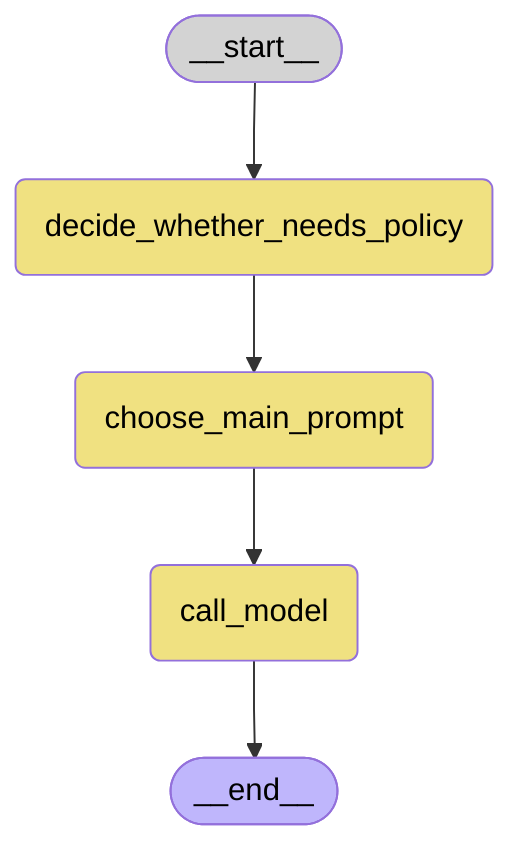

# LangGraph Flowchart

Use of LangGraph is currently very simple.

This graph can be used instead of a RAG chain.

The state is a variable which combines input to the retriever, collation of the chat history, and collation of any outputs generated by nodes in the graph used by later nodes (`intermediate_outputs` in `lgraph.graph.py`).

After the user types in their input, the nodes decide whether a policy document or documents is/are required to answer the question, and adds a filter condition for the retriever if so.

If one or more policy documents are required, the prompt needs to instruct the LLM to use verbatim text from the policy document in its answer. The appropriate prompt to use is selected and passed on via `intermediate_outputs` to the node which calls the LLM.

Conditional edges are not required in this graph because if a policy document is not required, the relevant filter condition is simply not added, and the default prompt is used.

