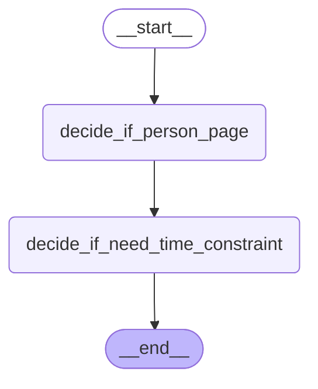

# LangGraph Flowchart

Use of LangGraph is currently very simple and limited, with only two nodes.

This graph is appended prior to the retriever.

The state represents input to the retriever.

After the user types in their input, the nodes decide whether filter conditions need to be set for retrieval based on the user's input.

